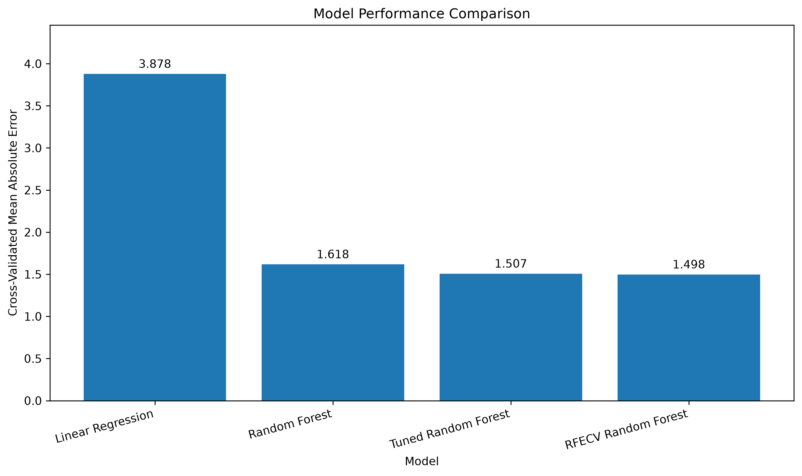
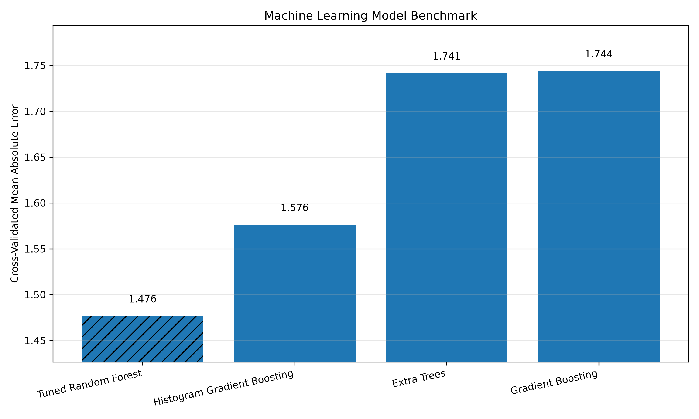
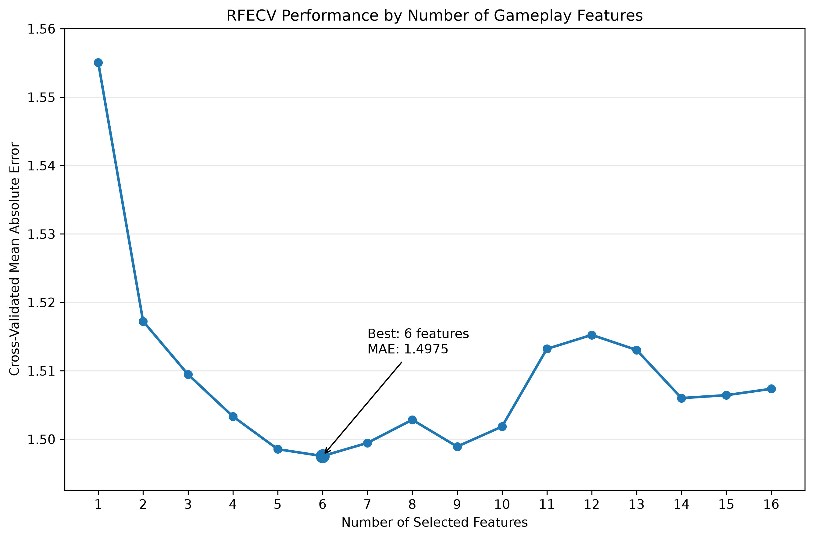
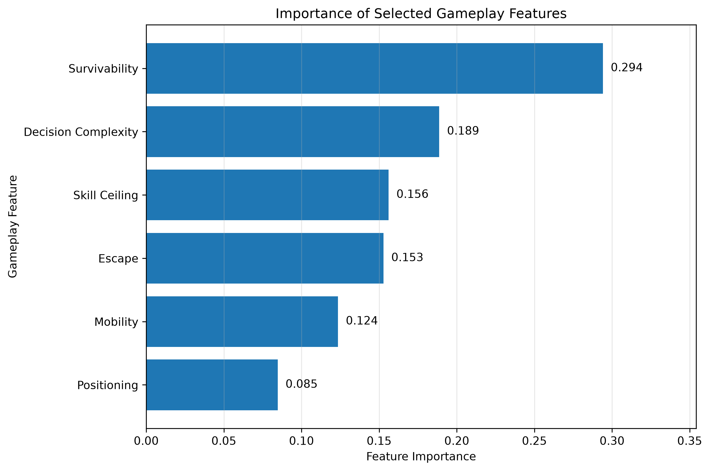

# Brawl Stars Balance Analyzer

An end-to-end machine learning project investigating which gameplay characteristics drive competitive performance in **Brawl Stars**.

Brawl Stars provides an interesting machine learning case study because competitive strength emerges from the interaction of dozens of gameplay mechanics, making it a natural testbed for feature engineering and predictive modeling.

The project combines gameplay attributes, engineered mechanics, and ranked competitive data into a reusable machine learning pipeline capable of predicting a brawler's overall competitive strength. It demonstrates a complete applied machine learning workflow from raw data processing and feature engineering to model optimization, feature selection, benchmarking, and visualization.

---

## 📄 Technical Report

For a detailed walkthrough of the project (including dataset construction, feature engineering, exploratory data analysis, machine learning experiments, feature selection, model benchmarking, and final conclusions), see the full technical report.

**➡️ [Brawl Stars Balance Analyzer Technical Report](Brawl_Stars_Balance_Analyzer_Technical_Report.pdf)**

---

# Key Results

- Built a machine learning dataset containing **103 brawlers** and **107 engineered features**
- Engineered **70+ gameplay and combat features** from raw game mechanics
- Compared **5 machine learning models** using identical 5-fold cross-validation
- Reduced gameplay features from **16 → 6** using Recursive Feature Elimination (RFECV)
- Improved prediction error from **MAE 3.878 → 1.476 (62% reduction)** over the initial baseline
- Identified **Survivability, Decision Complexity, and Skill Ceiling** as the strongest gameplay predictors

---

# Model Performance



Tree-based ensemble models substantially outperformed the Linear Regression baseline.

| Model | MAE |
|------|------:|
| Linear Regression | 3.878 |
| Initial Random Forest | 1.618 |
| Tuned Random Forest | 1.507 |
| RFECV Random Forest | 1.498 |
| **Final Tuned Random Forest (6 Features)** | **1.476** |

---

# Model Benchmark



The final model was compared against multiple ensemble learning algorithms using identical features, evaluation metrics, and five-fold cross-validation.

| Model | Cross-Validated MAE |
|------|------:|
| **Tuned Random Forest** | **1.476** |
| HistGradientBoosting | 1.576 |
| Extra Trees | 1.741 |
| Gradient Boosting | 1.744 |

Random Forest consistently produced the lowest prediction error.

---

# Feature Selection



Recursive Feature Elimination with Cross Validation identified an optimal subset of **six gameplay features**, reducing model complexity by **62.5%** while improving predictive performance.

---

# Final Feature Importance



The final model relied most heavily on:

1. Survivability
2. Decision Complexity
3. Skill Ceiling
4. Escape
5. Mobility
6. Positioning

These values represent **model feature importance**, not causal relationships.

---

# Project Workflow

```
Raw Data
    ↓
Cleaning & Validation
    ↓
Feature Engineering
    ↓
Master Dataset Construction
    ↓
Exploratory Data Analysis
    ↓
Baseline Modeling
    ↓
Cross Validation
    ↓
Hyperparameter Tuning
    ↓
Feature Selection (RFECV)
    ↓
Model Benchmarking
    ↓
Visualization & Analysis
```

---

# Dataset

The final dataset contains **103 brawlers** and **107 engineered features** spanning five major categories.

### Performance Metrics

- Win Rate
- Use Rate
- Meta Score
- Rank-specific statistics

### Core Character Statistics

- Health
- Damage
- Effective Range
- Ammo Count
- Movement Speed

### Combat Features

- Reload Speed
- Attack Cooldown
- Projectile Speed
- Projectile Width
- Burst Damage
- Sustained DPS

### Engineered Gameplay Features

Examples include:

- Mobility Score
- Escape Score
- Decision Complexity
- Skill Ceiling
- Survivability
- Team Utility
- Objective Pressure
- Area Control

### Binary Mechanics

Examples include:

- Dash
- Healing
- Stun
- Shield
- Invisibility
- Wall Break
- Splash Damage
- Knockback
- Piercing

---

# Machine Learning Pipeline

The project evaluates multiple supervised regression models for predicting competitive Meta Score.

Models evaluated include:

- Linear Regression
- Random Forest
- Tuned Random Forest
- Gradient Boosting
- HistGradientBoosting
- Extra Trees

Evaluation metrics:

- Mean Absolute Error (MAE)
- R² Score
- Five-fold Cross Validation

Feature engineering, recursive feature elimination, and hyperparameter tuning were all incorporated into the model selection process.

---

# Technical Skills Demonstrated

- Data Collection & Cleaning
- Feature Engineering
- Exploratory Data Analysis
- Statistical Analysis
- Cross Validation
- Hyperparameter Optimization
- Recursive Feature Elimination (RFECV)
- Ensemble Learning
- Model Benchmarking
- Data Visualization

---

# Project Structure

```
brawl-stars-balance-analyzer/

├── charts/
├── data/
├── reports/
├── results/
├── src/
│   ├── data_processing/
│   ├── machine_learning/
│   └── visualization/
│
├── README.md
└── .gitignore
```

---

# Technologies

- Python
- Pandas
- NumPy
- Matplotlib
- Scikit-learn
- BeautifulSoup
- Git
- GitHub

---

# Key Findings

- Carefully engineered gameplay features consistently outperformed raw character statistics.
- Recursive Feature Elimination improved generalization while reducing model complexity.
- Random Forest outperformed every other ensemble model evaluated.
- Better feature engineering produced larger performance gains than increasing model complexity.
- Static character attributes explain only part of competitive performance, suggesting future improvements should incorporate map-specific, temporal, and matchup-based information.

---

# Future Improvements

Potential extensions include:

- Map-specific performance
- Matchup prediction
- Time-series balance updates
- Team composition modeling
- XGBoost comparison
- New Brawler Predictor
