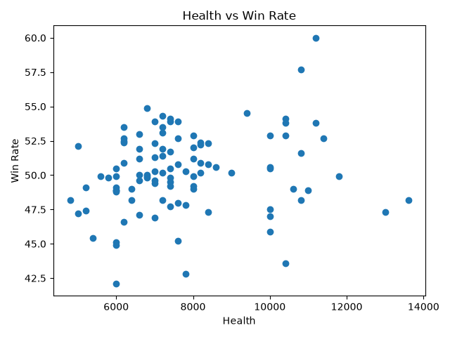
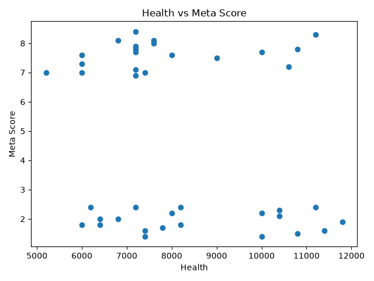

# Brawl Stars Balance Analyzer

A Python data science project exploring Brawl Stars balance, meta rankings, and gameplay characteristics.

## Project Overview

This project analyzes Brawl Stars performance data to identify:

- Underused brawlers
- Overused brawlers
- Relationships between win rate and meta rankings
- Factors that contribute to brawler strength

## Current Datasets

### Performance Dataset

Contains:

- Rank
- Name
- WinRate
- UseRate
- MetaScore

### Attributes Dataset

Contains:

- Name
- Class
- Health
- RangeCategory

## Project Structure

```text
brawl-stars-balance-analyzer/
├── data/
│   ├── brawler_performance.csv
│   ├── brawler_performance_scraped.csv
│   ├── brawler_attributes.csv
│   └── brawler_attributes_scraped.csv
│
├── src/
│   ├── collect_brawler_attributes.py
│   ├── attribute_analysis.py
│   ├── exploratory_analysis.py
│   └── basic_performance_analysis.py
│
├── charts/
│   ├── health_vs_win_rate.png
│   ├── health_vs_meta_score.png
│   ├── average_meta_score_by_class.png
│   └── average_win_rate_by_class.png
│
└── README.md
```
## Key Findings

### 1. MetaScore and WinRate Are Weakly Related

Correlation: 0.184

This suggests MetaScore captures factors beyond raw win rate.

### 2. Tanks Have High Win Rates

Tanks have the highest average win rate among analyzed classes.

### 3. Range Influences MetaScore

Very-long-range brawlers have higher average MetaScores despite lower win rates.

## Visualizations

### Health vs Win Rate



### Health vs Meta Score



## Technologies

- Python
- Pandas
- Matplotlib
- Git
- GitHub

## Future Work

- Additional attributes
- Machine learning models
- MetaScore prediction
- Feature importance analysis
